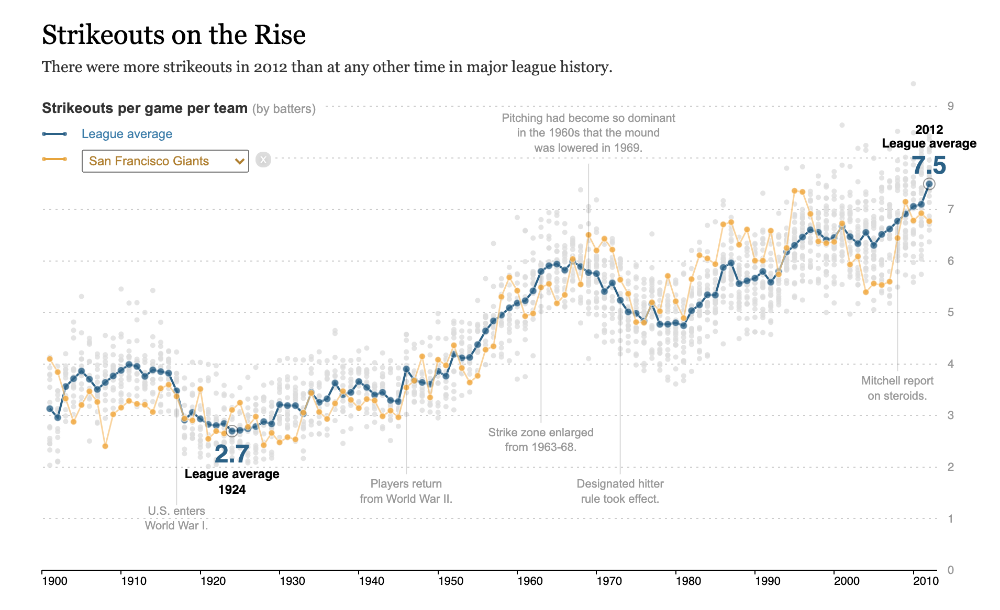
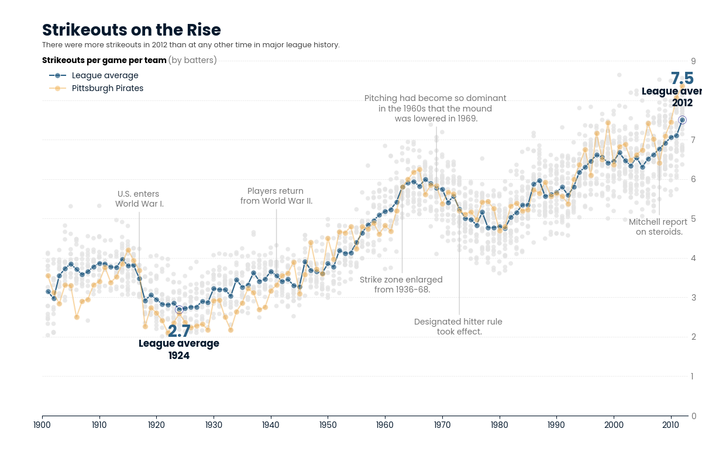

# Strikeouts on the Rise (NYT-style recreation)

This project is a practice exercise to brush up on **data visualization skills in Python**, with a focus on **matplotlib** and **seaborn**.

The inspiration comes from a classic New York Times visualization published in 2012, which shows how strikeouts per game have steadily increased over the history of Major League Baseball. While working through DataCamp’s **DataLab**, I came across a sample dataset related to strikeouts and decided to recreate the chart as closely as possible (non-interactive) using Python.

---

## Background & Motivation

- Goal: refresh and deepen hands-on data visualization skills in Python  
- Tools: `pandas`, `matplotlib`, `seaborn`  
- Context: DataCamp DataLab sample dataset on baseball strikeouts  
- Inspiration: New York Times “Strikeouts Are Still Soaring” visualization

Rather than focusing on analysis alone, this project emphasizes **editorial-style visualization**:
- layering context (all teams) with emphasis (league average + one team)
- careful annotation and hierarchy
- deliberate axis, gridline, and legend styling
- readability over defaults

---

## What This Project Covers

- Computing **league-wide weighted averages** (strikeouts per game)
- Plotting:
  - all teams as contextual scatter points
  - league average as a highlighted line
  - a single team highlighted for comparison
- Advanced matplotlib techniques:
  - custom annotations and callouts
  - selective tick label formatting
  - custom legends and layout control
  - text halos and background boxes for readability
- Recreating the *look and feel* of a newsroom graphic using Python

---

## Output (Recreated Plot)

---
## Limitations & Environment Constraints

- This project was built in **DataCamp DataLab**, a sandboxed environment.
- As a result:
  - Proprietary fonts used by the New York Times (e.g. Cheltenham) could not be installed.
  - A close serif approximation was used instead.
- The chart is **static**; interactivity was intentionally out of scope for this iteration.

---

## Possible Improvements / Next Steps

- **Add interactivity**, similar to the original NYT piece:
  - filter or highlight different teams dynamically
  - hover tooltips for teams and seasons
- This would likely require:
  - a JavaScript-based approach (e.g. **D3.js**), or
  - a Python framework that supports interactivity (e.g. Plotly, Altair)
- Typography:
  - using a local IDE instead of DataLab would allow custom font installation and closer visual matching

---

## Data Source

- Baseball team strikeout data (sample dataset provided in DataCamp DataLab)
- Original inspiration:
  - [*New York Times*, “Strikeouts Are Still Soaring” (2012)](https://archive.nytimes.com/www.nytimes.com/interactive/2013/03/29/sports/baseball/Strikeouts-Are-Still-Soaring.html?)

---

## Notes

This project is intentionally focused on **visual design, clarity, and storytelling**, rather than statistical novelty. It serves as a focused refresher on building publication-quality charts with Python’s core visualization libraries.
